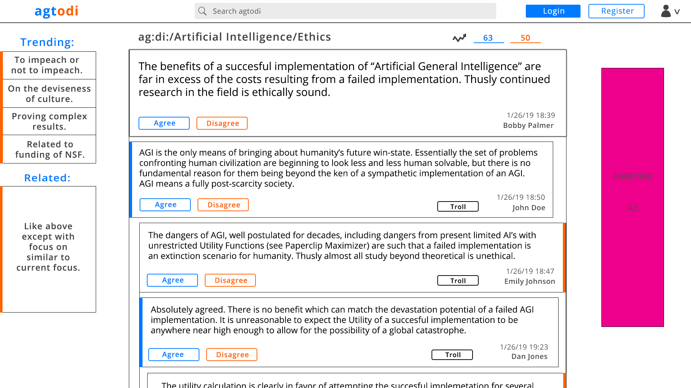

# 450-Final: Argument/Consensus Engine

###  Product Definition:

We have observed that today’s online communities fail to provide digital spaces promoting sound and reasonable debate between users. Often attempts at allowing debate and argument online become breeding grounds for trolling and other types of abusive online behavior which turn away users hoping to find a platform for sharing, promoting, and debating ideas and having reasonable dialog.

Our product will be a website which facilitates an online community of users to engage in the sharing, promotion, and debate of ideas. Our primary objective is giving users tools which enable them to self-police the web community to promote reasonable discourse at the expense of trolling and other types of abusive digital behavior. Our product will resemble existing web communities such as Reddit which allow for separate discussions on a wide range of topics to take place on the same platform, while limiting the range of acceptable behavior in the community to the same behaviors people exhibit when talking to each other face to face; avoiding the conflicts that inevitably rise on the internet when users feel protected in exhibiting negative behaviors by digital anonymity. We believe our product will be well positioned as an alternative web community for users disillusioned by the prevalence of abusive behaviors in other widely used web community’s.  

## Initial UI Mockup

## Authors

* **Bobby Palmer**
* **Ryan McIntyre**
* **Autumn Skoog**
* **Jonathon Makepeace**
